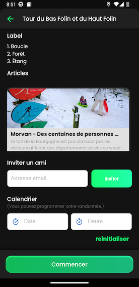

.. _hike:

Hike
------------

The user can choose the date and the time.

The user can also invite a friend by enter his email adress but it's not mandatory.

After that he receives a notification.

..  image:: schedule.png

..  image:: schedule2.png

The user can  see in the section "Mes randonnées" the hike that he creates.

..  image:: hike.png

If the user click on the article , he arrives on the web pages.

