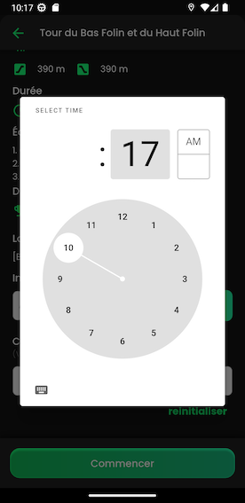

.. _hike:

Hike
------------

The user can choose the date and the time.

The user can also invite a friend by enter his email adress but it's not mandatory.

After that he receives a notification.

The user can  see in the section "Mes randonnées" the hike that he creates.

The user also can see the article that which corresponds to the place, if the user

click, he arrives on the web pages.

.. image:: invite1.png
.. image:: invite.png
..  image:: schedule.png

..  image:: hike.png
..  image:: article.png